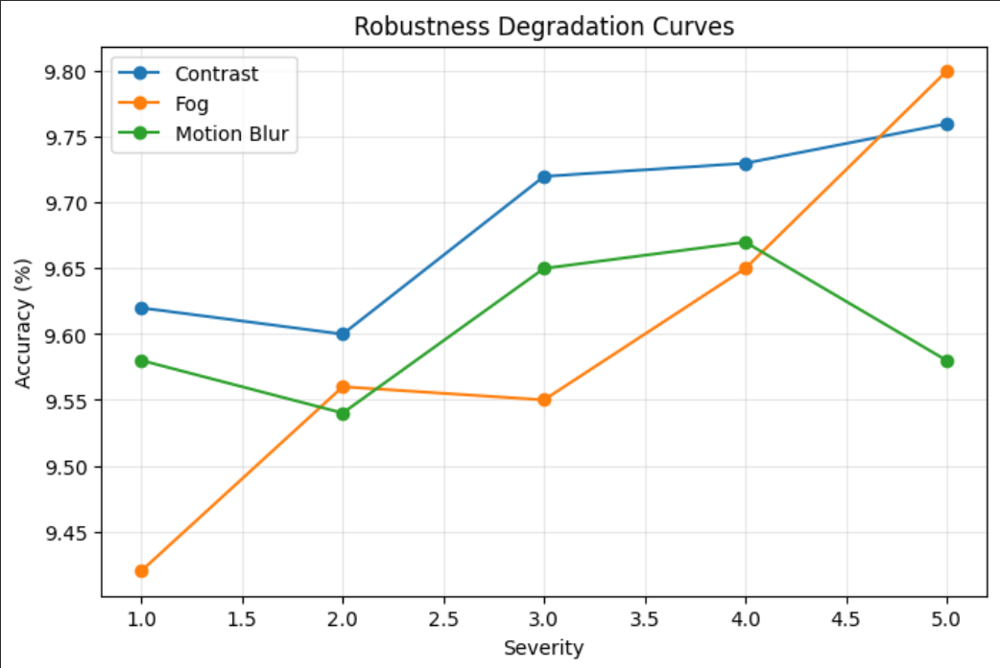

<h1 align="center">Failure Modes of Vision Models</h1>

When CNNs Fail: Robustness Under Distribution Shift

---

> Second-year AI undergraduate exploring robustness and reliability in deep learning systems.
> This project explores how convolutional neural networks behave when the world is not clean, structured, and benchmark-friendly.
---

## 1. Research Question

Do convolutional neural networks degrade gradually under distribution shift, or do certain corruptions cause sharp, predictable failure patterns?

Modern vision models perform extremely well on curated datasets. But real-world data includes blur, noise, compression artifacts, lighting shifts, and environmental distortions.

Instead of only measuring performance drop, this project studies how the failure unfolds.

---

## 2. Problem

High benchmark accuracy does **not** guarantee real-world reliability.

Models optimized for clean datasets often exhibit brittle behavior when exposed to distribution shifts. Understanding these failures is essential for building dependable AI systems.

---

## 3. Why It Matters

Real-world deployment rarely resembles benchmark conditions.

Autonomous systems, medical imaging pipelines, and safety-critical perception models must operate under imperfect sensing conditions. Robustness is not secondary — it is foundational.

This raises a central question:

> Do modern CNNs fail gradually, or collapse under specific perturbations?

---

## 4. Method

### Models
- ResNet18  
- DenseNet121  

### Training
- Dataset: CIFAR-10  
- Standard augmentation pipeline  
- Cross-entropy optimization  

### Robustness Evaluation
- Dataset: CIFAR-10-C  
- Severity levels: 1–5  
- Accuracy and performance drop analysis  

### Corruptions Studied
- Contrast  
- Fog  
- Motion Blur  
- Gaussian Noise  
- JPEG Compression  
- Brightness  

Rather than reporting a single robustness score, the analysis focuses on severity-wise degradation trends.

---

## 5. Key Findings

- Accuracy dropped by up to 43% under severe contrast corruption
- Robustness was highly corruption-dependent
- Structural corruptions (contrast, fog, blur) caused sharper degradation than pixel-level noise
- JPEG compression and brightness changes resulted in comparatively milder decline
- DenseNet121 showed slightly better resilience overall

These results suggest that model failure is structured  not random.

---

## 6.Severity Degradation Patterns

Different corruptions produced different collapse behaviors:

- Contrast → near-linear degradation

- Fog → threshold-like collapse at higher severities

- Motion Blur → early degradation followed by partial stabilization

This indicates that CNN vulnerability depends strongly on what type of visual information is disrupted , especially edges and spatial structure.

  

---

## 7. Interpretability: Why Do Models Fail?

Grad-CAM was used to examine model attention under corruption.

### Observed Behavior
- Clean inputs produce object-centric activation  
- Severe corruptions cause attention drift toward background regions  
- Feature localization weakens  

This suggests that robustness failures may stem from disruption of hierarchical feature representations rather than simple noise sensitivity.

  

---

## 8. Architecture Insight

While DenseNet121 showed marginally better robustness, both architectures remained vulnerable to structural distortions.

Improved connectivity does not necessarily translate to distributional resilience.

Robustness remains an open challenge in deep vision systems.

---

## 9. Limitations

- CIFAR-10 is low resolution (32×32)  
- Only CNN architectures evaluated  
- Corruptions are synthetic  
- No robustness training applied  

Recognizing these constraints prevents overgeneralization.

---

## 10. Future Directions

- Vision Transformer robustness comparison  
- Robust training strategies (AugMix, DeepAugment)  
- Higher-resolution datasets  
- Failure prediction and uncertainty metrics  

---

## 11. Repository Structure

notebooks/
01_train_resnet18.ipynb
02_train_densenet121.ipynb
03_cifar10c_evaluation.ipynb
04_severity_curves.ipynb
05_gradcam_analysis.ipynb

figures/
gradcum_analysis.png
severity_curves.png

notes/
research_notes.md

README

LICENSE

.gitignore

---

## 12. Takeaway

Robustness is not binary.

Convolutional networks exhibit structured, corruption-specific degradation patterns that can be systematically analyzed.

Understanding these failure modes is essential for building reliable AI systems in real-world environments.
